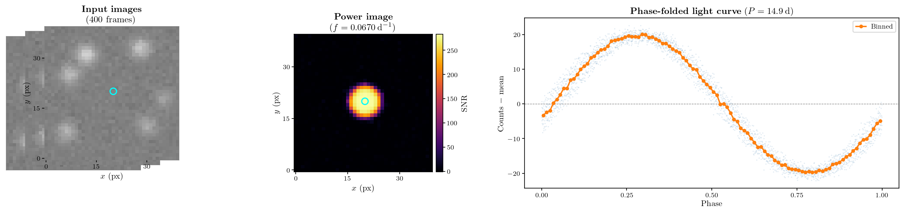
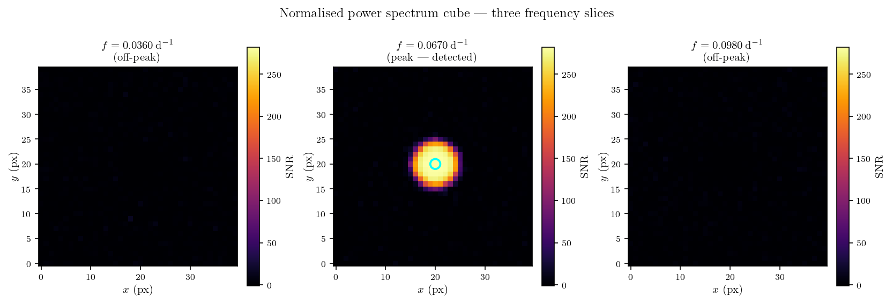
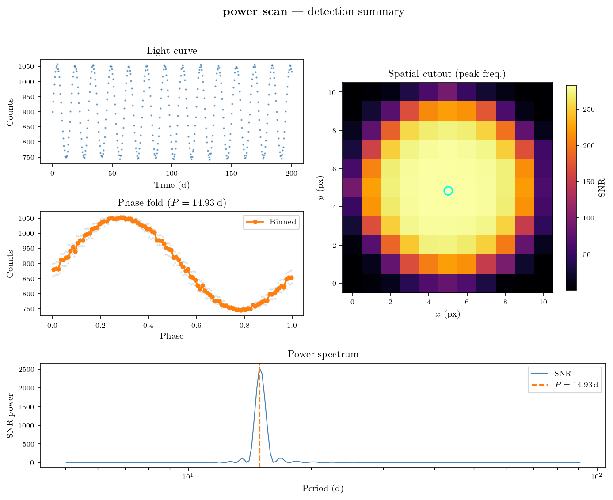

# power_scan

[](https://github.com/CheerfulUser/power_scan/actions/workflows/tests.yml)
[](https://www.python.org/)
[](https://opensource.org/licenses/MIT)
[](https://github.com/CheerfulUser/power_scan)

Search for variable stars and other periodic sources in time-series imaging data using the Lomb-Scargle power spectrum.

---

## How it works

`power_scan` treats a time-series of 2-D images as a 3-D data cube of shape `[time, y, x]` and computes a Lomb-Scargle periodogram independently at every spatial pixel, producing a **power spectrum cube** of shape `[frequency, y, x]`.  At each frequency, the normalised power image is searched for point-source detections.  Detections are then spatially grouped, alias-cleaned, and characterised by their phase-folded light curves.



### Step-by-step

| Step | What happens |
|------|-------------|
| **1. Ingest** | A 3-D image stack `data[time, y, x]` and a 1-D time array are provided. NaN frames are removed and observations are sorted by time. |
| **2. Power spectrum cube** | A Lomb-Scargle periodogram is computed at every pixel simultaneously using the fast batched implementation in [`nifty_ls`](https://github.com/flatironinstitute/nifty_ls). The result is normalised per-frequency with sigma-clipped statistics so that the cube is in units of local SNR. |
| **3. Source detection** | For each frequency slice where any pixel exceeds `snr_search_lim`, point sources are extracted using [`sep`](https://sep.readthedocs.io) (default) or `DAOStarFinder`. A local SNR cut (`local_threshold`) removes extended or spurious detections. |
| **4. Cleaning** | Detections are spatially grouped with DBSCAN. Within each group only the highest-SNR detection is retained. Frequency aliases (harmonics at 0.5× and 2×) are identified and collapsed to the fundamental period. |
| **5. Light curves** | Aperture photometry is extracted for each source. The light curve is phase-folded and binned at the detected period. |

### The power spectrum cube

Slicing the cube at frequencies away from a variable source's period shows a featureless noise background.  At the source period a compact peak appears at the source position.



### Detection output

For each detected source `power_scan` provides the period, sky position, phase-folded light curve, and the full power spectrum at that location.



---

## Installation

```bash
pip install git+https://github.com/CheerfulUser/power_scan.git
```

Or clone and install in editable mode:

```bash
git clone https://github.com/CheerfulUser/power_scan.git
cd power_scan
pip install -e .
```

---

## Quick start

```python
import numpy as np
import power_scan as ps

# data shape: [n_times, n_y, n_x]
time = np.load('time.npy')   # 1-D array of observation times (days)
data = np.load('flux.npy')   # 3-D image stack

det = ps.periodogram_detection(
    time        = time,
    data        = data,
    period_lim  = 'auto',   # or [min_period, max_period]
    snr_lim     = 5,        # minimum local SNR for a detection
)

print(det.sources[['xcentroid', 'ycentroid', 'period', 'local_sig']])

det.plot_object(index=0)            # 4-panel diagnostic plot
det.save_detections(savepath='./')  # write sources to CSV
```

---

## Key parameters

| Parameter | Default | Description |
|-----------|---------|-------------|
| `period_lim` | `'auto'` | Period search range `[min, max]` in the same units as `time`. `'auto'` sets limits to 2× the sampling interval and ½ the observing window. |
| `snr_lim` | `5` | Minimum local SNR a detection must exceed to be kept. |
| `snr_search_lim` | `10` | Minimum peak SNR in a frequency slice for source detection to be attempted. |
| `local_threshold` | `10` | Minimum SNR measured against a local sky annulus. |
| `detection_method` | `'sep'` | Source finder: `'sep'` (recommended) or `'dao'`. |
| `aperture_radius` | `1.5` | Photometry aperture radius in pixels. |
| `block_size` | `None` | Spatial block size for memory-limited datasets. `None` processes the full frame at once. |
| `cpu` | `-1` | Number of parallel workers (`-1` = all cores). |

---

## Output attributes

After running, the detector exposes:

| Attribute | Shape | Description |
|-----------|-------|-------------|
| `det.sources` | `DataFrame` | One row per detected variable; columns include `xcentroid`, `ycentroid`, `freq`, `period`, `local_sig`. |
| `det.lcs` | `[N, 2, T]` | Raw light curves `[time, flux]` for each source. |
| `det.phase` | `[N, 2, T]` | Phase-folded light curves. |
| `det.binned` | `[N, 2, B]` | Phase-binned light curves (default 100 bins). |
| `det.power_norm` | `[F, Y, X]` | Normalised power spectrum cube. |
| `det.freq` | `[F]` | Frequency array (days⁻¹). |

---

## Requirements

- Python ≥ 3.9
- numpy < 2.0
- astropy
- scipy
- photutils
- pandas
- joblib
- [nifty_ls](https://github.com/flatironinstitute/nifty_ls)
- sep
- scikit-learn
